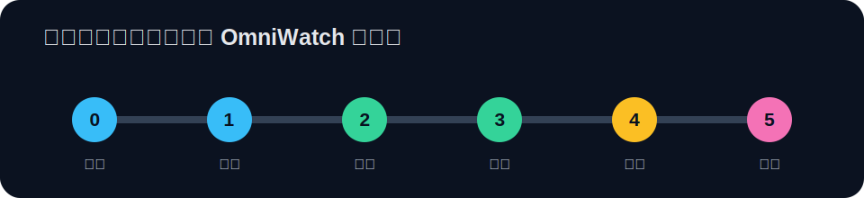

# OmniWatch 自定义屏幕样式：从零开始

这套教程写给第一次接触 Python、坐标绘图或 OmniWatch 的你。无需先读懂固件源码：按顺序完成每一课，就能从“让屏幕显示一句话”逐步做到可上传、会局部刷新、带进度条和历史图表的个人样式。

## 开始之前

- 准备一台可以正常显示监控数据的 OmniWatch。
- 准备安装并正在运行的 OmniWatch 电脑端程序。
- 使用任意纯文本编辑器；推荐 Visual Studio Code。
- 保存 Python 文件时选择 **UTF-8（无 BOM）**。
- 示例以默认竖屏 `240 × 320` 为准。

> 完全没写过 Python 也没关系。先复制可运行示例，再一次只改一个地方，是最稳妥的学习方式。

## 推荐阅读顺序

| 课次 | 文档 | 学完能做到 |
| --- | --- | --- |
| 第 0 课 | [认识样式、坐标和工具](example/00-准备工作.md) | 看懂屏幕坐标，准备编辑器 |
| 第 1 课 | [做出第一块屏幕](example/01-第一个样式.md) | 显示背景、标题和固定文字 |
| 第 2 课 | [把监控数据放上屏幕](example/02-读取监控数据.md) | 安全显示主机名、CPU 和时间 |
| 第 3 课 | [布局、颜色与进度条](example/03-布局颜色与进度条.md) | 做出层次清楚的仪表盘 |
| 第 4 课 | [局部刷新：让屏幕更流畅](example/04-局部刷新.md) | 只重绘变化区域，减少闪烁 |
| 第 5 课 | [历史图表与性能优化](example/05-图表与性能.md) | 绘制 CPU 历史图并避开性能坑 |
| 第 6 课 | [校验、上传与排错](example/06-上传与排错.md) | 把自己的样式上传到设备 |
| 排错必读 | [如何查看和导出日志](example/08-查看日志.md) | 找到电脑端、设备端和上传日志 |
| 开发调试 | [Dev 模式使用说明](example/09-Dev模式.md) | 无硬件查看数据，理解开启后的行为 |
| 扩展数据 | [自定义数据采集](example/10-自定义数据.md) | 把自己的脚本数据加入 `snapshot.ext` |
| 随查随用 | [Canvas 绘图接口速查表](example/07-Canvas接口速查.md) | 查找文字、矩形、线条、图表用法 |

## 可直接复制的代码

| 文件 | 对应阶段 | 说明 |
| --- | --- | --- |
| [style_hello.py](example/code/style_hello.py) | 第 1 课 | 最小可上传样式 |
| [style_my_status.py](example/code/style_my_status.py) | 第 2 课 | 读取真实监控数据 |
| [style_my_dashboard.py](example/code/style_my_dashboard.py) | 第 3～4 课 | 卡片、进度条和局部刷新 |
| [style_my_chart.py](example/code/style_my_chart.py) | 第 5 课 | 完整历史图表示例 |
| [custom_data_plugin_demo](example/code/custom_data_plugin_demo) | 第 10 课 | 支持独立环境和 ZIP 分发的自定义数据插件示例 |

## 一眼记住五条硬规则

1. 文件名必须是 `style_样式名.py`，例如 `name = "hello"` 对应 `style_hello.py`。
2. `name` 只能包含小写英文字母、数字和下划线；`zh_name` 才写中文。
3. `type` 必须是字符串常量 `"custom"`。
4. 样式类必须实现 `create_dirty_regions`、`draw_visible`、`draw_dirty`。
5. 文件必须是无 BOM 的 UTF-8，大小为 1～16384 字节，并且文件末尾只注册一次。

遇到问题时，先去 [第 6 课的错误对照表](example/06-上传与排错.md#常见错误对照表)，再按 [日志教程](example/08-查看日志.md) 收集线索。
