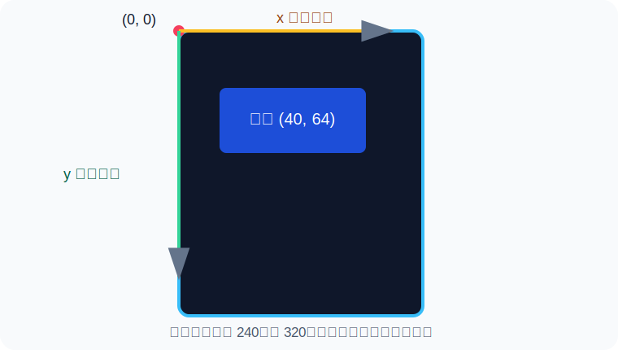
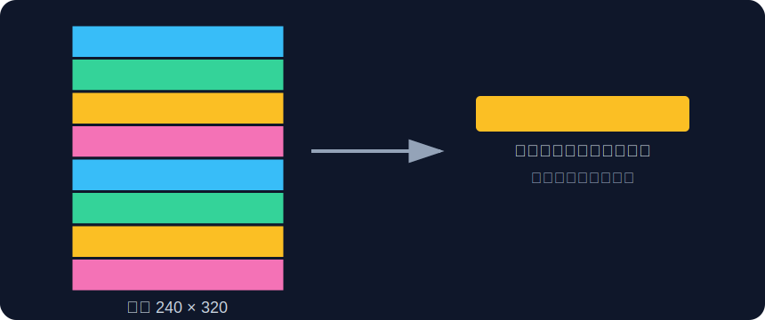

# 第 0 课：认识样式、坐标和工具

[返回总目录](../README.md) · [下一课：第一个样式](01-第一个样式.md)

## 样式到底是什么

OmniWatch 会定期收到电脑的 CPU、网络、时间等数据。**样式**是一份 Python 文件，它决定“取哪些数据、放在哪里、用什么颜色画出来”。它不负责采集数据，也不需要操作 LCD 驱动。

```text
电脑采集数据 → snapshot 数据快照 → 你的 Style 类 → Canvas 画布 → LCD 屏幕
```

你主要会接触两个对象：

- `snapshot`：一个像多层抽屉一样的数据字典。
- `canvas`：一盒彩笔，提供写字、画矩形、画线和画图表的方法。

## 屏幕坐标怎么读

默认竖屏宽 240 像素、高 320 像素。左上角是 `(0, 0)`；向右走，`x` 变大；向下走，`y` 变大。



例如：

```python
canvas.text(8, 12, "HELLO", WHITE)
```

意思是从屏幕左边 8 像素、顶部 12 像素的位置开始写字。初学时建议四周至少留 8 像素边距。

## 为什么屏幕被分成条带

RP2040 内存有限，OmniWatch 不会一次在内存里放下整张 240×320 图片，而是使用约 240×40 的小画布从上到下分批渲染。



这带来一条重要规则：**你写的仍然是完整屏幕坐标**。不要因为当前条带从 `y=80` 开始，就把原来的 `y=90` 改成 `y=10`。Canvas 会自动裁剪条带之外的图形。

## 准备编辑器

以 Visual Studio Code 为例：

1. 新建一个文件。
2. 右下角若显示其他编码，单击编码名称。
3. 选择“使用编码保存”。
4. 选择“UTF-8”，不要选择“UTF-8 with BOM”。
5. 文件扩展名保存为 `.py`。

## 第一次动手前的检查

- [ ] 我知道左上角是 `(0, 0)`。
- [ ] 我知道 `x` 向右增大，`y` 向下增大。
- [ ] 我会把文件保存为无 BOM 的 UTF-8。
- [ ] 我会先复制示例，再一次只改一处。

准备好了就进入 [第 1 课](01-第一个样式.md)。
