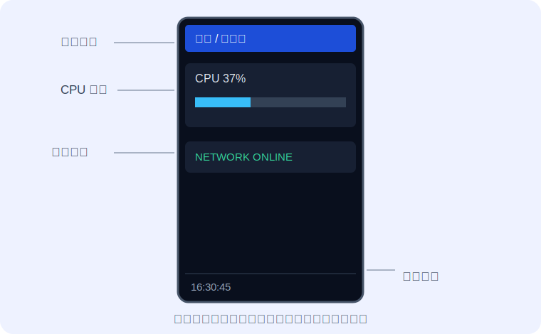

# 第 3 课：布局、颜色与进度条

[上一课](02-读取监控数据.md) · [返回总目录](../README.md) · [下一课](04-局部刷新.md)

这一课使用 [style_my_dashboard.py](code/style_my_dashboard.py)。它把信息分成标题、CPU 卡片、网络状态和页脚。



## 先在纸上分区

不要边写代码边猜坐标。先列一张布局表：

| 区域 | x | y | 宽 | 高 |
| --- | ---: | ---: | ---: | ---: |
| 标题 | 8 | 8 | 224 | 28 |
| CPU 卡片 | 8 | 48 | 224 | 72 |
| 网络状态 | 8 | 136 | 224 | 32 |
| 页脚 | 8 | 292 | 224 | 18 |

检查公式：`x + 宽 ≤ 240`，`y + 高 ≤ 320`。相邻区域再留 8～16 像素空隙。

## 颜色来自 config

直接导入调色板，避免手抄 RGB565 数值：

```python
from config import BLACK, BLUE, DARK, GRAY, GREEN, HEIGHT, WHITE, WIDTH, YELLOW
```

建议分工：

- `BLACK`：背景。
- `DARK`：卡片底色或进度条轨道。
- `WHITE`、`GRAY`：主要文字、次要文字。
- `GREEN`、`YELLOW`、`BLUE`：状态和强调色。

## 画一个进度条

进度条由“轨道 + 已使用部分”两层矩形组成：

```python
def _draw_progress(self, canvas, percent):
    """绘制范围为 0～100 的 CPU 进度条。"""
    value = max(0, min(100, self._number(percent)))
    canvas.fill_rect(16, 88, 208, 12, DARK)
    used_width = int(208 * value / 100)
    canvas.fill_rect(16, 88, used_width, 12, BLUE)
```

当 CPU 为 50% 时，`used_width` 就是 104 像素。限制范围很重要，否则异常的 150% 会画出卡片边界。

## 根据状态改变颜色

```python
online = bool(network.get("online"))
text = "ONLINE" if online else "OFFLINE"
color = GREEN if online else YELLOW
canvas.text(16, 148, text, color)
```

颜色不只是装饰，它应该帮助用户快速读懂状态。不要让同一颜色一会儿表示正常、一会儿又表示警告。

## 动手练习

1. 把 CPU 卡片整体向下移动 8 像素，记得同步修改其中所有元素。
2. CPU 超过 80% 时把进度条颜色改成 `YELLOW`。
3. 在纸上设计一张内存卡片，先写坐标表，再动代码。
