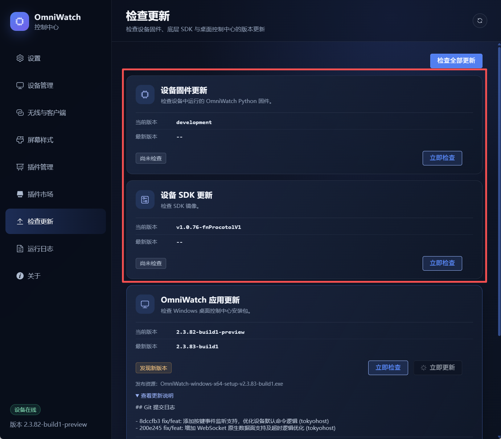

# OmniWatch 设备使用说明书

本文面向 OmniWatch 普通用户，介绍如何连接设备、显示电脑监控数据、切换屏幕样式，以及安全地更新设备固件和 SDK。

> 本说明以 Windows 版 OmniWatch 控制中心和 ESP32-S3 设备为主。界面会根据设备型号和连接方式自动隐藏或禁用不适用的功能。

## 1. 先了解两个 Type-C 接口

设备正面有两个 Type-C 接口，接口用途不同。

| 接口 | 主要用途 | 推荐使用场景 |
| --- | --- | --- |
| 左侧 `USB CDC` | 原生 USB 数据通信、日常监控、自动识别、受控 SDK 更新 | **日常使用优先连接此接口** |
| 右侧 `COM` | USB 转串口控制台、兼容通信、手动维护 | 原生 USB 无法连接，或需要强刷恢复时使用 |

注意：

- 请使用支持数据传输的 Type-C 线。部分充电线只能供电，电脑无法识别设备。
- 日常只需连接左侧 `USB CDC` 口，不需要同时连接两个接口。
- 在线受控更新 SDK 必须使用左侧原生 `USB CDC` 连接；通过 Wi-Fi 或右侧 `COM` 连接时，该功能会显示为不支持。
- 更新期间不要拔线、断电，也不要让电脑进入睡眠状态。

## 2. 五分钟快速开始

### 2.1 安装并启动控制中心

1. 获取与电脑系统匹配的 OmniWatch Windows 安装包。
2. 双击安装包，按提示完成安装。
3. 如 Windows 弹出用户账户控制提示，请允许程序运行。
4. 从桌面或开始菜单启动 **OmniWatch**。

启动后，OmniWatch 会驻留在 Windows 系统托盘。关闭控制中心窗口只会隐藏界面，不会停止后台监控；需要完全退出时，请右键托盘图标并选择“退出”。

### 2.2 连接设备

1. 用数据线连接设备左侧 `USB CDC` 接口和电脑。
2. 等待 Windows 完成 USB 设备识别。
3. 打开 OmniWatch 控制中心，进入“设备管理”。
4. 页面左下角显示“设备在线”，并能看到开发板、连接方式、固件版本和 SDK 版本，即表示连接成功。
5. 如果没有自动连接，单击“主动探测”。

设备初次启动或更新后可能会重新枚举 USB 串口，短暂离线属于正常现象，请等待约 10～30 秒。

### 2.3 选择显示内容

1. 进入“屏幕样式”。
2. 选择需要的主界面样式。
3. 根据需要选择待机样式。
4. 单击“应用样式”。
5. 进入“设置”，调整屏幕方向、背光亮度和采集间隔后，单击“保存配置”。

至此，设备会持续显示电脑采集到的 CPU、内存、磁盘、网络等数据。不同样式展示的项目可能不同。

## 3. 日常使用

### 3.1 控制中心主要页面

| 页面 | 用途 |
| --- | --- |
| 设置 | 调整显示、采集、连接和任务参数 |
| 设备管理 | 查看设备状态、重启设备、截图，以及手动更新固件和 SDK |
| 无线与客户端 | 配置设备 Wi-Fi，管理 WebSocket 客户端 |
| 屏幕样式 | 选择、上传或删除屏幕样式 |
| 插件管理 | 启用、配置和同步数据插件 |
| 插件市场 | 安装扩展数据插件或屏幕样式 |
| 检查更新 | 在线检查设备固件、设备 SDK 和控制中心版本 |
| 运行日志 | 查看连接、采集、传输和更新过程 |

### 3.2 常用显示设置

在“设置”页面可调整：

- **界面样式**：设备正常接收数据时显示的主页面。
- **待机设置**：启用后，设备长时间收不到有效数据时切换到待机页面；不需要待机可选择“不进入待机”。
- **屏幕旋转**：支持 `0°` 和 `180°`，按设备摆放方向选择。
- **背光亮度**：建议先使用中等亮度，再根据环境调整。
- **采集间隔**：间隔越短，数据变化越及时，但电脑和 USB 通信负载也越高；一般保持默认值即可。

修改后务必单击“保存配置”。

### 3.3 使用 Wi-Fi 连接

支持 Wi-Fi 的 ESP32-S3 设备可在首次 USB 配网后脱离数据线使用。

1. 先通过左侧 `USB CDC` 口连接设备。
2. 进入“无线与客户端”，扫描附近无线网络。
3. 选择网络，输入密码并连接。
4. 等待页面显示设备 IP 和已连接状态。
5. 断开 USB 数据线，并通过其他稳定方式给设备供电。
6. 回到“设备管理”，单击“主动探测”。

提示：

- 常见 ESP32-S3 设备仅支持 2.4 GHz Wi-Fi。
- 电脑与设备需要位于可互访的同一局域网。
- USB 和 Wi-Fi 同时可用时，设备优先使用 USB。
- 如果开启了“强制切换 USB-CDC”，控制中心不会主动搜索 Wi-Fi 设备。需要使用 Wi-Fi 时请关闭此开关。

### 3.4 托盘快捷操作

右键 Windows 系统托盘中的 OmniWatch 图标，可快速打开配置、切换界面样式、旋转屏幕、截图、查看或导出日志、检查更新，以及设置开机自动启动。

## 4. 更新前须知

OmniWatch 包含三个可独立更新的部分：

| 更新项目 | 更新内容 | 常见文件 |
| --- | --- | --- |
| 设备固件 | 设备上运行的 OmniWatch Python 程序、内置样式及配置代码 | `OmniWatch-pico-full-v...zip` |
| 设备 SDK | ESP32-S3 底层 MicroPython 系统和原生驱动 | `micropython-ESP32_GENERIC_S3-...v....bin` |
| OmniWatch 应用 | Windows 控制中心和电脑端采集程序 | `OmniWatch-windows-x64-setup-v....exe` |

### 4.1 官方下载地址

- **SDK 下载**：[获取最新版 Pico Vision MicroPython SDK](https://github.com/tokyohost/pico-vision-micropython-sdk/releases/latest)
- **设备固件及 OmniWatch 驱动下载**：[获取最新版 OmniWatch 固件和 Windows 控制中心](https://github.com/tokyohost/omniwatch-doc/releases/latest)
- **本设备适用固件**：[下载 ESP32-S3 ST7789 2.4 英寸 10Pin A 款固件（v2.3.83-build1）](https://github.com/tokyohost/omniwatch-doc/releases/download/v2.3.83-build1/OmniWatch-pico-full-v2.3.83-build1-esp32-s3-st7789-2.4inch-10pin-a.zip)

手动下载时请按以下规则选择文件：

- SDK **优先选择文件名中带 `N16R8` 的 `.bin` 镜像**，典型文件名为 `micropython-ESP32_GENERIC_S3-N16R8-v版本号.bin`。不要误选 `N8R8`、其他芯片型号或源码压缩包。
- 本说明书对应设备的固件文件名应以 `OmniWatch-pico-full-v版本号-esp32-s3-st7789-2.4inch-10pin-a.zip` 结尾。
- 固件 ZIP 下载后不要解压，直接在控制中心的“设备管理 → 固件更新”中选择。
- Windows 驱动及控制中心请选择文件名类似 `OmniWatch-windows-x64-setup-v版本号.exe` 的安装包。

> 发布页出现多个附件时，应先核对文件名中的 `N16R8`、`esp32-s3` 和 `st7789-2.4inch-10pin-a`。文件名不匹配时不要刷写。

更新前请确认：

- 设备通过左侧 `USB CDC` 接口稳定连接。
- 笔记本已接通电源，并临时关闭自动睡眠。
- 没有打开 Thonny、串口助手、烧录工具等可能占用设备串口的软件。
- 使用与设备开发板、存储规格和屏幕型号匹配的升级文件。
- 重要自定义样式和插件源文件已保存在电脑上。升级一般不会主动删除用户配置，但仍建议保留备份。

如果固件和 SDK 都有更新，推荐顺序为：**先更新 SDK，设备重新上线并确认版本后，再更新设备固件**。最后再更新 Windows 控制中心。

## 5. 在线更新（推荐）

在线更新会自动识别设备型号并选择匹配资源，是普通用户的首选方式。

1. 保持设备在线，进入“检查更新”。
2. 单击右上角“检查全部更新”，也可以分别单击某一项目的“立即检查”。
3. 对比“当前版本”和“最新版本”，需要时展开“查看更新说明”。
4. 出现“发现新版本”并显示“立即更新”后，按推荐顺序逐项更新。
5. 阅读确认提示，然后单击“立即更新”。
6. 等待进度达到 100%，并确认日志显示成功。
7. 设备重新连接后，再次检查版本。

更新过程中：

- **设备固件更新**会暂停监控、下载匹配的 ZIP 包、复制变化文件并重启设备。
- **设备 SDK 更新**会校验镜像，使设备自动进入下载模式，完成刷写后重启并核对 SDK 版本。
- **OmniWatch 应用更新**会下载安装包、退出当前程序并启动安装程序；请按安装向导完成操作。

如果“立即更新”没有出现，通常表示已是最新版本，或者服务器没有当前硬件对应的升级资源。SDK 项显示“当前设备不适用”时，一般表示当前设备不是 ESP32-S3，无需处理。

## 6. 手动更新设备固件

网络不便、在线资源不可用或需要安装指定版本时，可进入“设备管理”手动更新。

1. 先确认设备详情中的开发板型号和 LCD 型号。
2. 从[固件及驱动发布页](https://github.com/tokyohost/omniwatch-doc/releases/latest)下载完全匹配硬件的 `OmniWatch-pico-full-v...-esp32-s3-st7789-2.4inch-10pin-a.zip` 固件包，不要自行解压；也可直接使用[本设备 v2.3.83-build1 固件](https://github.com/tokyohost/omniwatch-doc/releases/download/v2.3.83-build1/OmniWatch-pico-full-v2.3.83-build1-esp32-s3-st7789-2.4inch-10pin-a.zip)。
3. 在“固件更新”区域单击“选择固件 ZIP”。
4. 从串口列表中选择该设备对应的目标串口。通常页面会自动推荐正确端口。
5. 普通升级不要勾选“全量更新”。系统会比较文件 Hash，只复制缺失或内容不同的文件，速度更快。
6. 单击“开始固件更新”，等待复制完成和设备自动重启。
7. 设备恢复在线后，核对“固件版本”和屏幕显示。

只有在固件损坏、文件状态异常，或技术支持明确要求时才勾选“全量更新”。全量更新会跳过设备文件 Hash 检查，直接替换升级包中的全部文件。

> 不同开发板和 LCD 的固件包不能混用。无型号后缀的兼容包只适用于特定的 RP2040 与 2 英寸屏幕组合；不确定时应使用在线更新，或先向设备提供方确认。

## 7. 手动更新设备 SDK

SDK 更新风险高于普通固件更新。设备工作正常时优先使用“检查更新”页面的一键更新。

### 7.1 受控 USB 更新（推荐）

适用条件：

- 设备为 ESP32-S3。
- 使用左侧原生 `USB CDC` 接口连接。
- “设备详情 → SDK 受控刷写”显示“支持”。

操作步骤：

1. 在“设备管理 → USB SDK 更新”中单击“选择并校验 SDK 镜像”。
2. 从[SDK 最新发布页](https://github.com/tokyohost/pico-vision-micropython-sdk/releases/latest)选择完整的 `N16R8` `.bin` 镜像。
3. 确认页面显示的镜像文件、目标版本、大小和 SHA-256 校验信息。
4. 单击“刷写 USB SDK”。
5. 再次核对目标版本并确认更新。
6. 保持供电和数据线稳定，等待设备进入下载模式、写入、重启并重新连接。
7. 核对设备详情中的 SDK 版本；随后检查并更新设备固件。

如果“刷写 USB SDK”按钮为灰色，请先检查是否接错 Type-C 口，以及设备详情中“连接方式”和“SDK 受控刷写”状态。旧版固件可能尚不支持自动进入下载模式，可先更新一次设备固件；仍不支持时再使用强刷方式。

### 7.2 强刷 SDK（仅用于恢复）

“强刷 SDK”适用于设备无法正常启动、没有已连接设备快照、受控刷写不可用，或设备已被人工置于 ROM 下载模式的情况。

1. 准备并选择正确的 `.bin` SDK 镜像，等待校验通过。
2. 将目标 ESP32-S3 置于下载模式。不同硬件的操作可能不同，常见方式是按住 `BOOT` 后连接 USB，必要时短按 `RESET`。
3. 刷新并选择目标设备的 COM 口。
4. 单击“强刷 SDK”，仔细核对弹窗中的镜像、版本和 COM 口。
5. 确认后等待刷写完成，期间不要操作其他串口设备。
6. 设备重启上线后核对 SDK 版本，再更新设备固件。

强刷前必须确认 COM 口属于目标设备。选错端口可能会刷写其他已连接的 ESP32 设备。如果同时连接了多个开发板，建议先断开其他开发板。

## 8. 常见问题排查

### 控制中心显示“设备离线”

按以下顺序检查：

1. 确认使用的是数据线，并连接左侧 `USB CDC` 口。
2. 更换电脑 USB 接口或数据线。
3. 关闭 Thonny、串口助手和其他烧录软件。
4. 等待 10～30 秒后单击“主动探测”。
5. 重启设备，再重启 OmniWatch。
6. 进入“运行日志”，搜索“正在搜索”“握手”“PONG”或“通信异常”。

### 设备在线，但屏幕没有数据

- 确认已在“屏幕样式”中选择样式并单击“应用样式”。
- 检查“设置”中的采集任务是否启用。
- 查看“运行日志”中是否持续出现发送和设备 ACK。
- 如果屏幕显示等待连接或待机时钟，说明设备暂时没有收到有效数据，不一定是屏幕故障。

### 固件更新找不到目标串口

- 固件文件更新需要可访问设备文件系统的 REPL 串口，数据通信串口和 REPL 串口可能是同一设备枚举出的不同 COM 口。
- 拔插一次左侧 `USB CDC`，等待 Windows 重新识别后刷新端口列表。
- 断开其他开发板，避免多个相似串口导致无法唯一匹配。

### SDK 更新按钮不可用

- 确认设备是 ESP32-S3，而不是 RP2040。
- 确认当前连接为左侧原生 `USB CDC`，不是 Wi-Fi、右侧 `COM` 或 CH343 兼容串口。
- 先更新设备固件，使其支持受控进入下载模式。
- 仍无法使用时，按“强刷 SDK”流程恢复，或联系技术支持。

### 更新中断或失败

1. 不要连续反复点击更新按钮。
2. 保留“设备实时日志”或“运行日志”中的完整错误信息。
3. 确认设备能否重新上线；能上线时先重新检查版本。
4. 固件文件不完整时，可使用正确的 ZIP 包执行一次“全量更新”。
5. SDK 无法启动时，使用正确镜像进入 ROM 下载模式后强刷。

## 9. 获取帮助时请提供

为便于快速定位问题，请一并提供：

- Windows 版本和 OmniWatch 应用版本；
- 开发板型号、LCD 型号和分辨率；
- 当前固件版本和 SDK 版本；
- 使用的接口及连接方式（USB CDC、COM 或 Wi-Fi）；
- 失败前执行的完整步骤；
- “运行日志”或“设备实时日志”中的错误内容；
- 如涉及手动更新，提供所用 ZIP 或 BIN 的完整文件名。

自定义屏幕和插件的进一步使用方法，请参阅 [OmniWatch 自定义屏幕样式教程](README.md)。Linux 用户可参阅 [Linux 安装说明](linux_install.md) 和 [Linux Wi-Fi 配置说明](linux-wifi-config.md)。
